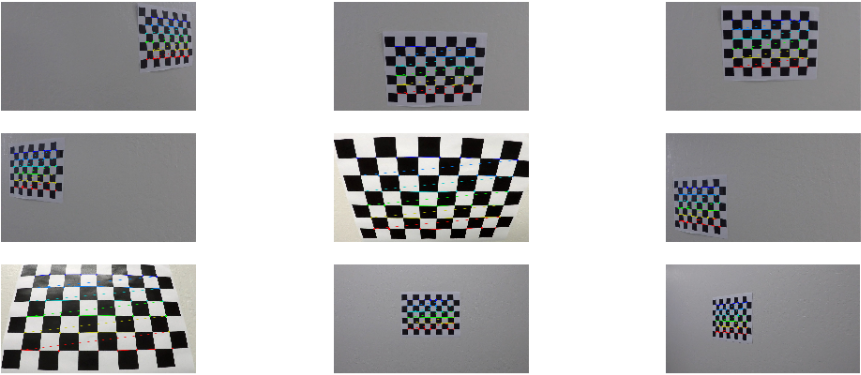
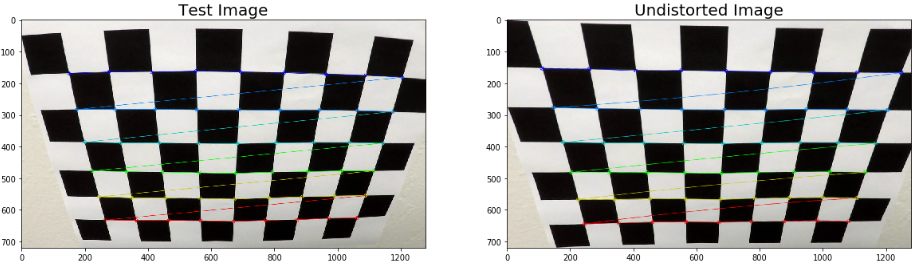
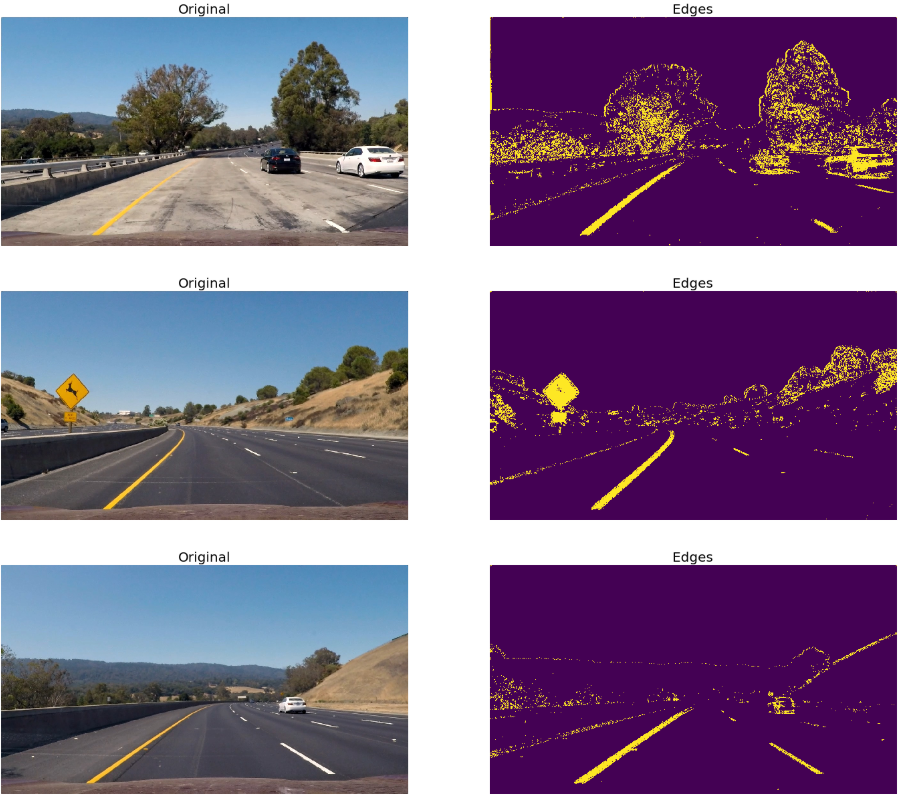
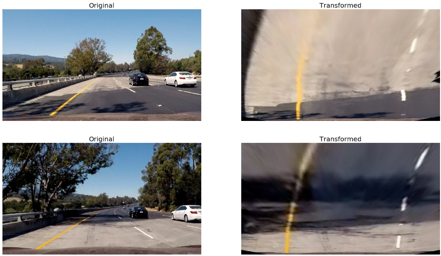
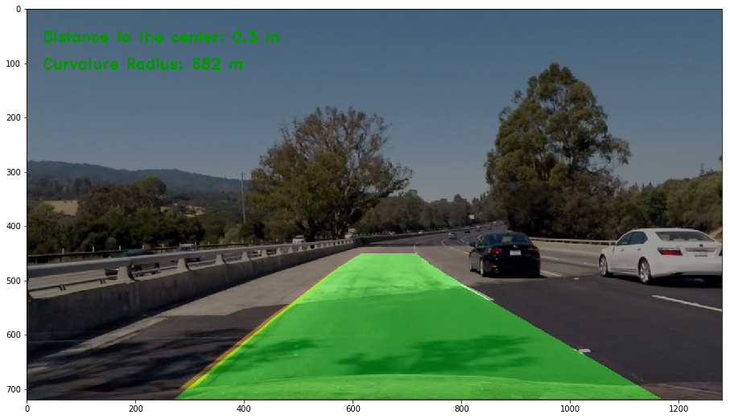

# Advanced Lane Finding

## Overview
---

The goal of this project is to develop a software pipeline to identify the lane boundaries in a video. That includes:

* Compute the camera calibration matrix and distortion coefficients given a set of chessboard images.
* Apply a distortion correction to raw images.
* Use color transforms, gradients, etc., to create a thresholded binary image.
* Apply a perspective transform to rectify binary image ("birds-eye view").
* Detect lane pixels and fit to find the lane boundary.
* Determine the curvature of the lane and vehicle position with respect to center.
* Warp the detected lane boundaries back onto the original image.
* Output visual display of the lane boundaries and numerical estimation of lane curvature and vehicle position.

The project is submitted with the following structure: 
* `Advanced-Lane-Finding.ipnyb` (The main code and test images)
* `README.md` a report writeup file (markdown)
* `output_videos/` (contains the generated videos resulted from the pipeline)

## Implementation
---

The lane detection in a video stream is implemented as below:

* Camera Calibration
* Remove Distortion
* Edge Detection
* Perspective Transformation
* Lane Detection

These steps are described in the upcoming sections. The full implementation is available at [jupyter notebook](Advanced-Lane-Finding.ipynb)

### Camera Calibration

In order to calibrate the front facing camera, the calibration matrix and distortion coefficients should be retrieved using the given chessboard images. The OpenCV functions `findChessboardCorners()` and `drawChessboardCorners()` are used to identify the locations of corners on a set of chessboard images taken from different angles. At this point, we compute and return the camera calibration matrix and distortion coefficients.
Chessboard-Corners.png

### Remove Distortion

Using the camera calibration matrix and distortion coefficients obtained from `calibrate()`, the OpenCV function `undistort()` removes distortion from highway driving images.

### Edge Detection

Identifying the lane lines can be done much more effeciently by considering different color spaces separately. To do that, I've converted the undistorted images to HLS color space to create binary thresholded images. After some testing, I found that the S channel did a fairly good job of identifying the white and yellow lane lines in the test images. 

The conversion to HLS space was done by OpenCV `cvtColor()` function. Using OpenCV `sobel()` function, the gradient absolute value was calculated. Then, the gradient direction and magnitude  were applied to the image matrix. In the end, the S channel was extracted from the HLS color space and a threshold was applied to it. Below are some examples where the edges are identified:

### Perspective Transformation

To get a "birds eye view" of the road that focuses only on the lane lines, the OpenCV functions `getPerspectiveTransform()` and `warpPerspective()` were used. These functions take a matrix of four points on the source and destination images to transform the perspective. The selection of these points on both source and destination images were done manually by looking at the locations of the lane lines on the test images. Below are some of the test images that were transformed:

### Lane Detection Pipeline

Now, to detect the lane lines, the transformed image were analyzed by using the so-called "Peaks in a Histogram" method. In this method, the histogram of section of the image were processed to identify the peaks that represent the location of the lane lines. This was implemented in two classes:

* SlidingWindow: It consists of the coordinates of a rectanglar window which is used to highlight the sections of the image in which there is a higher probability to find a lane line. 

* LaneLine - Is used to keep the track of the left and right lane lines in the image. It also calculates the curvature radius as well as the camera distance from the center line. 

Below is an example of the lane lines detected:

The video processing pipeline takes the first image of the input video to initialize the calibration matrix and distortion coefficients to calibrate and undistort the video stream. Additionally, the histogram of the transformed first image is created. This histogram is then used to initialize the SlidingWindow instances for both left and right lane lines.

Finally, for each of the video frames, the edges are detected and the perspective transform is performed. Also the curvature radius and camera distance from the center line are calculated and converted to meters, which then will be printed in the output image.

To read the project video in frames, and to output the detected lane markings the `moviepy` library is used.
The output video can be found here: [project video](output_videos/project_video_output.mp4)

## Limitations of the pipeline

The video pipeline performed well on the main project video, but as it is clear in the [challenge video output](output_videos/challenge_video_output.mp4) or [harder challenge video output](output_videos/harder_challenge_video_output.mp4), the detection of the lane does not work well. That's possibly because of these reasons:

* The pipeline does not take the changes in the lighting conditions into account well.
* The car gets closer to the road sides
* The bends are more steep, and the roads have different characteristics
* The heavy shadow created by the concrete wall in the middle of the highway creates confusion for the pipeline